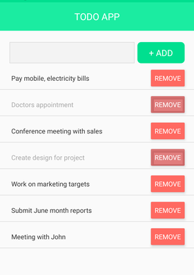

Simple React Native - Expo Todo App

## Preview

## Available Scripts

In the project directory, you can run:

### `npm install`

To install all the dependencies for project to run

### `npm start`

Runs the app in the development mode.